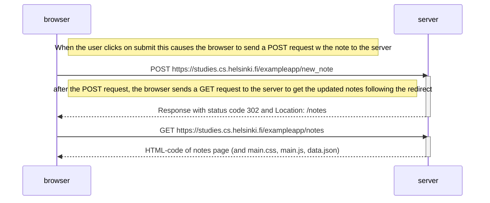

```mermaid
sequenceDiagram
    participant browser
    participant server

    Note right of browser: When the user clicks on submit this causes the browser to send a POST request w the note to the server

    browser->>server: POST https://studies.cs.helsinki.fi/exampleapp/new_note
    activate server

      Note right of browser: after the POST request, the browser sends a GET request to the server to get the updated notes following the redirect

    server-->>browser: Response with status code 302 and Location: /notes
    deactivate server

    browser->>server: GET https://studies.cs.helsinki.fi/exampleapp/notes
    activate server
    server-->>browser: HTML-code of notes page (and main.css, main.js, data.json)
    deactivate server

```
