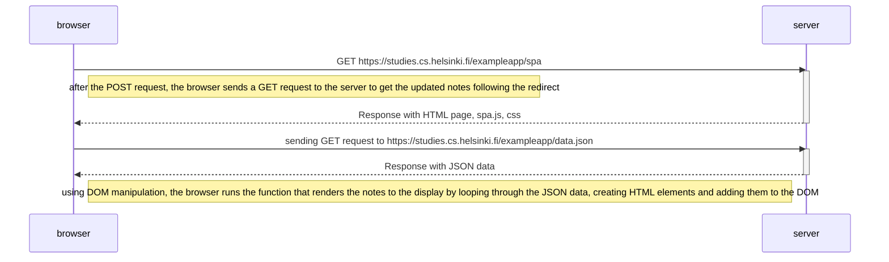

```mermaid
sequenceDiagram
    participant browser
    participant server


    browser->>server: GET https://studies.cs.helsinki.fi/exampleapp/spa
    activate server

      Note right of browser: after the POST request, the browser sends a GET request to the server to get the updated notes following the redirect
    server-->>browser: Response with HTML page, spa.js, css

    deactivate server

    browser->>server: sending GET request to https://studies.cs.helsinki.fi/exampleapp/data.json
    activate server
    server-->>browser: Response with JSON data
    deactivate server

      Note right of browser: using DOM manipulation, the browser runs the function that renders the notes to the display by looping through the JSON data, creating HTML elements and adding them to the DOM

```
