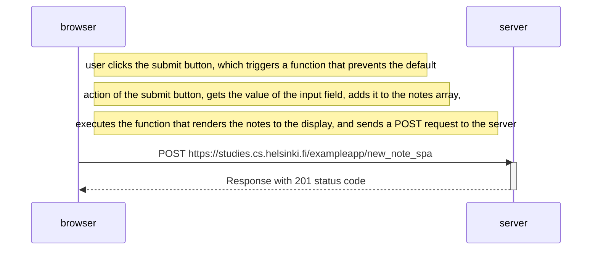

```mermaid
sequenceDiagram
    participant browser
    participant server

      Note right of browser: user clicks the submit button, which triggers a function that prevents the default
      Note right of browser: action of the submit button, gets the value of the input field, adds it to the notes array,
        Note right of browser: executes the function that renders the notes to the display, and sends a POST request to the server

    browser->>server: POST https://studies.cs.helsinki.fi/exampleapp/new_note_spa
    activate server

    server-->>browser: Response with 201 status code
    deactivate server
```
